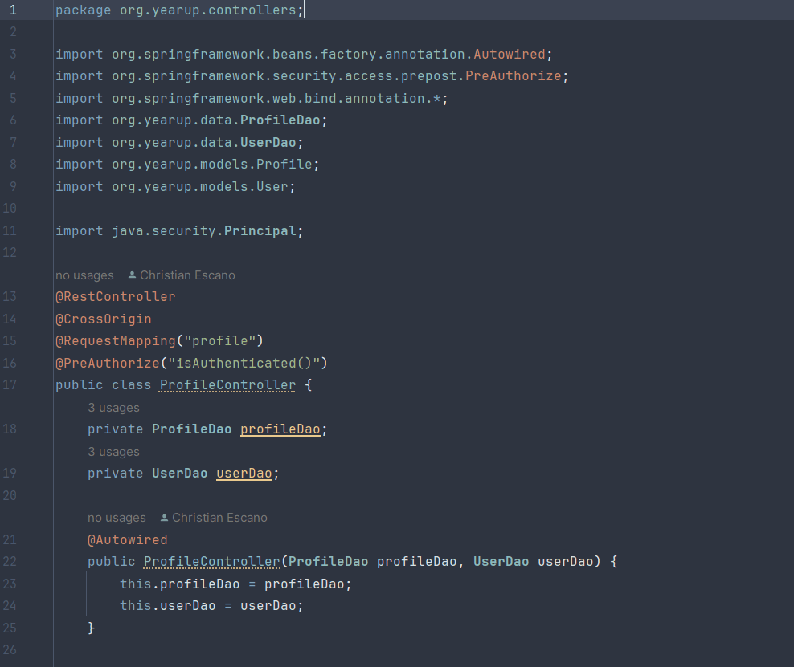
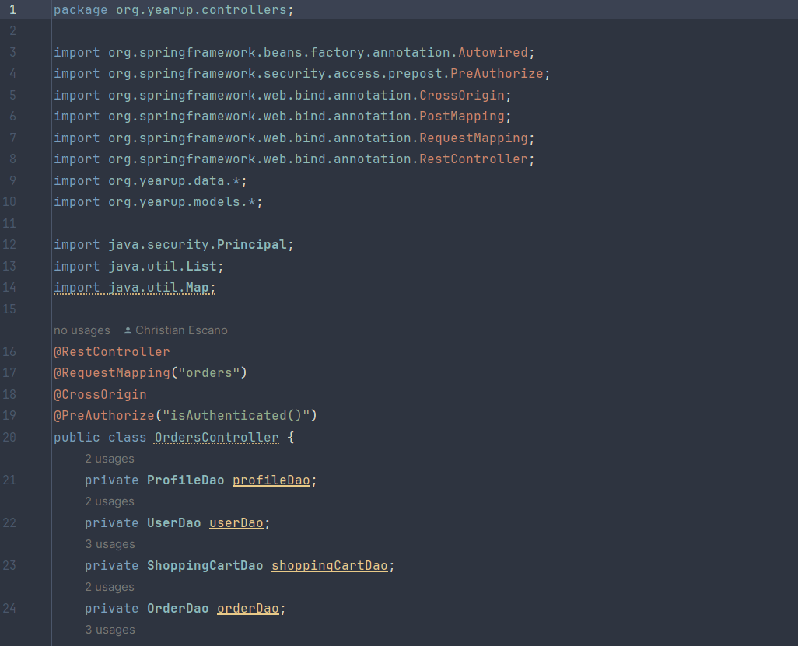
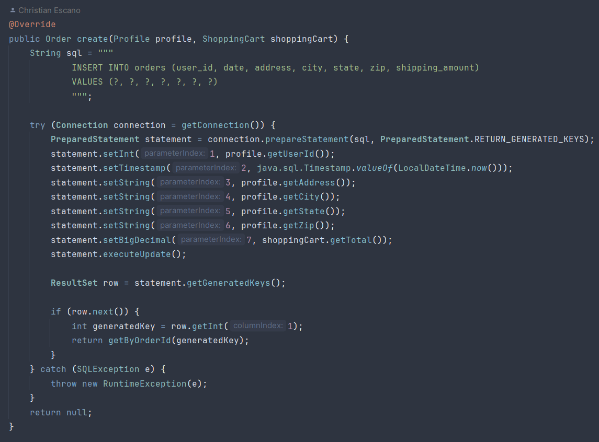

# EasyShop Application
This is an API for the Easyshop store. You can visit the website and register an account, log in, change profile settings, add things to your cart, and delete the cart. Although the features are not many we hope that you can find your everyday products. Finding everyday products with Easy Shop!

## Controllers
### Categories Controller

### Products Controller

### ShoppingCart Controller

### Profile Controller

### Orders Controller


## Interesting Piece Of Code

This create method is part of the MySqlOrderDao. It communicates with the database and creates
an order entry in the order table of the database. I had to plan out the
steps required to make this work and took full advantage of drawing diagrams.

## Tech Stack
1. HTML, CSS (with BootStrap Library), and JavaScript
2. Java with SpringBoot framework and Sprint Web API
3. Postman for API endpoint testing
4. MySQL for data storage

## API Endpoints
When the application is running it will start listening for HTTP request at the base url `http://localhost:8080`. Here is a list briefly describing each endpoint:
- [Getting All Categories](#getting-all-categories)
- [Getting A Category](#getting-a-category)
- [Making A New Category](#making-a-new-category)
- [Updating A Category](#updating-a-category)
- [Deleting A Category](#deleting-a-category)
- [Search For Products](#search-for-products)
- [Get A Product By ID](#get-a-product-by-id)
- [Add A Product](#add-a-product)
- [Update A Product](#update-a-product)
- [Delete A Product](#delete-a-product)
- [Get Shopping Cart](#get-shopping-cart)
- [Add Product To Shopping Cart](#add-product-to-shopping-cart)
- [Update Product Quantity Of Shopping Cart](#update-product-quantity-of-shopping-cart)
- [Clear Shopping Cart](#clear-shopping-cart)
- [Get Profile Information](#get-profile-information)
- [Update Profile Information](#update-profile-information)
- [Check Out](#check-out)

---
### Getting All Categories
Request
```
URL  : http://localhost:8080/categories
Type : GET
Body : NULL
```
Response
```
CODE : 200 OK
BODY : list of categories
```
---
### Getting A Category
Request
```
URL  : http://localhost:8080/categories/1
Type : GET
Body : NULL
```
Response
```
CODE : 200 OK
BODY :
{
    "categoryId": 1
    "name": "Electronics",
    "description": "Explore the latest gadgets and electronic devices"
}
```
---
### Making A New Category
Request
```
URL  : http://localhost:8080/categories
Type : POST
Body :
{
    "name": "[name of category]",
    "description": "[description of category]"
}
```
Response
```
CODE : 201 CREATED
BODY :
{
    "categoryId": [category ID]
    "name": "[name of category]",
    "description": "[description of category]"
}
```
---
### Updating A Category
Request
```
URL  : http://localhost:8080/categories/4
Type : PUT
Body : 
{
    "name": "Updating Demo",
    "description": "Updating the demo category"
}
```
Response
```
CODE : 200 OK
BODY : list of categories
```
---
### Deleting A Category
Request
```
URL  : http://localhost:8080/categories/#
Type : DELETE
BODY : NULL
```
Response
```
CODE : 204 NO CONTENT
BODY : NULL
```
---
### Search For Products
Request
```
URL  : http://localhost:8080/products{?cat=#}{&minPrice=#}{&maxPrice=#}{&color=[a-z]*}
Type : GET
BODY : NULL
```
Response
```
CODE : 200 OK
BODY : list of products
```
---
### Get A Product By ID
Request
```
URL  : http://localhost:8080/products/#
Type : GET
BODY : NULL
```
Response
```
CODE : 200 OK / 404 NOT FOUND
BODY :
{
    "productId": [product ID],
    "name": "[name of product]",
    "price": [price of product],
    "categoryId": [category ID of product],
    "description": "[description of product]",
    "color": "[color of product]",
    "stock": [current stock of product],
    "imageUrl": "[image URL of product]",
    "featured": [true/false]
}
```
---
### Add A Product
Request
```
URL  : http://localhost:8080/products
Type : POST
BODY :
{
    "name": "[name of product]",
    "price": [price of product],
    "categoryId": [category ID of product],
    "description": "[description of product]",
    "color": "[color of product]",
    "stock": [current stock of product],
    "imageUrl": "[image URL of product]",
    "featured": [true/false]
}
```
Response
```
CODE : 200 OK
BODY :
{
    "productId": [product ID],
    "name": "[name of product]",
    "price": [price of product],
    "categoryId": [category ID of product],
    "description": "[description of product]",
    "color": "[color of product]",
    "stock": [current stock of product],
    "imageUrl": "[image URL of product]",
    "featured": [true/false]
}
```
---
### Update A Product
Request
```
URL  : http://localhost:8080/products/1
Type : PUT
BODY :
{
    "name": "[name of product]",
    "price": [price of product],
    "categoryId": [category ID of product],
    "description": "[description of product]",
    "color": "[color of product]",
    "stock": [current stock of product],
    "imageUrl": "[image URL of product]",
    "featured": [true/false]
}
```
Response
```
CODE : 200 OK
BODY : NULL
```
---
### Delete A Product
Request
```
URL  : http://localhost:8080/products/1
Type : DELETE
BODY : NULL
```
Response
```
CODE : 200 OK / 404 NOT FOUND
BODY : NULL
```
---
### Get Shopping Cart
Request
```
URL  : http://localhost:8080/cart
Type : GET
BODY : NULL
```
Response
```
CODE : 200 OK
BODY :
{
    "items": {
        "[product ID]": {
            "product": {
                "productId": [ID of product]
                "name": "[name of product]",
                "price": [price of product],
                "categoryId": [category ID of product],
                "description": "[description of product]",
                "color": "[color of product]",
                "stock": [current stock of product],
                "imageUrl": "[image URL of product]",
                "featured": [true/false]
            },
            "quantity": [quantity number],
            "discountPercent": [discount number],
            "lineTotal": [total for this product line item]
        }
    }
    "total": [total of shopping cart]
}
```
---
### Add Product To Shopping Cart
Request
```
URL  : http://localhost:8080/cart/product/15
Type : POST
BODY : NULL
```
Response
```
CODE : 200 OK
BODY :
{
    "items": {
        "[product ID]": {
            "product": {
                "productId": [ID of product]
                "name": "[name of product]",
                "price": [price of product],
                "categoryId": [category ID of product],
                "description": "[description of product]",
                "color": "[color of product]",
                "stock": [current stock of product],
                "imageUrl": "[image URL of product]",
                "featured": [true/false]
            },
            "quantity": [quantity number],
            "discountPercent": [discount number],
            "lineTotal": [total for this product line item]
        }
    }
    "total": [total of shopping cart]
}
```
---
### Update Product Quantity Of Shopping Cart
Request
```
URL  : http://localhost:8080/cart/products/15
Type : PUT
BODY :
{
    "quantity": [number]
}
```
Response
```
CODE : 200 OK
BODY :
{
    "items": {
        "[product ID]": {
            "product": {
                "productId": [ID of product]
                "name": "[name of product]",
                "price": [price of product],
                "categoryId": [category ID of product],
                "description": "[description of product]",
                "color": "[color of product]",
                "stock": [current stock of product],
                "imageUrl": "[image URL of product]",
                "featured": [true/false]
            },
            "quantity": [quantity from request body],
            "discountPercent": [discount number],
            "lineTotal": [total for this product line item]
        }
    }
    "total": [total of shopping cart]
}
```
---
### Clear Shopping Cart
Request
```
URL  : http://localhost:8080/cart
Type : DELETE
BODY : NULL
```
Response
```
CODE : 200 OK
BODY :
{
    "items": {},
    "total": 0
}
```
---
### get-profile-information
Request
```
URL  : http://localhost:8080/profile
Type : GET
BODY : null
```
Response
```
CODE : 200 OK
BODY :
{
    "userId": [ID of user],
    "firstName": "[first name of user]",
    "lastName": "[last name of user]",
    "phone": "[phone number of user]",
    "email": "[email of user]",
    "address": "[address of user]",
    "city": "[city of user]",
    "state": "[state of user]",
    "zip": "[zip of user]"
}
```
---
### update-profile-information
Request
```
URL  : http://localhost:8080/profile
Type : PUT
BODY : 
{
    "firstName": "[first name of user]",
    "lastName": "[last name of user]",
    "phone": "[phone number of user]",
    "email": "[email of user]",
    "address": "[address of user]",
    "city": "[city of user]",
    "state": "[state of user]",
    "zip": "[zip of user]"
}
```
Response
```
CODE : 200 OK
BODY :
{
    "userId": [ID of user],
    "firstName": "[first name of user]",
    "lastName": "[last name of user]",
    "phone": "[phone number of user]",
    "email": "[email of user]",
    "address": "[address of user]",
    "city": "[city of user]",
    "state": "[state of user]",
    "zip": "[zip of user]"
}
```
---
### Check Out
Request
```
URL  : http://localhost:8080/orders
Type : POST
BODY : NULL
```
Response
```
CODE : 200 OK
BODY :
[
    {
        "orderLineItemId": [ID of line item],
        "orderId": [ID of order],
        "productId": [ID of product],
        "salesPrice": [price of line item],
        "quantity": [quantity ordered],
        "discount" [discount percentage]:
    }
]
```